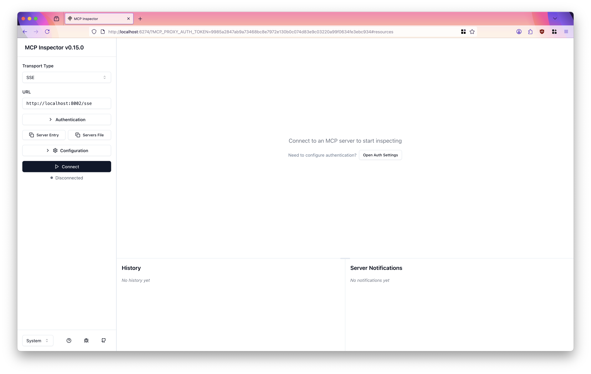
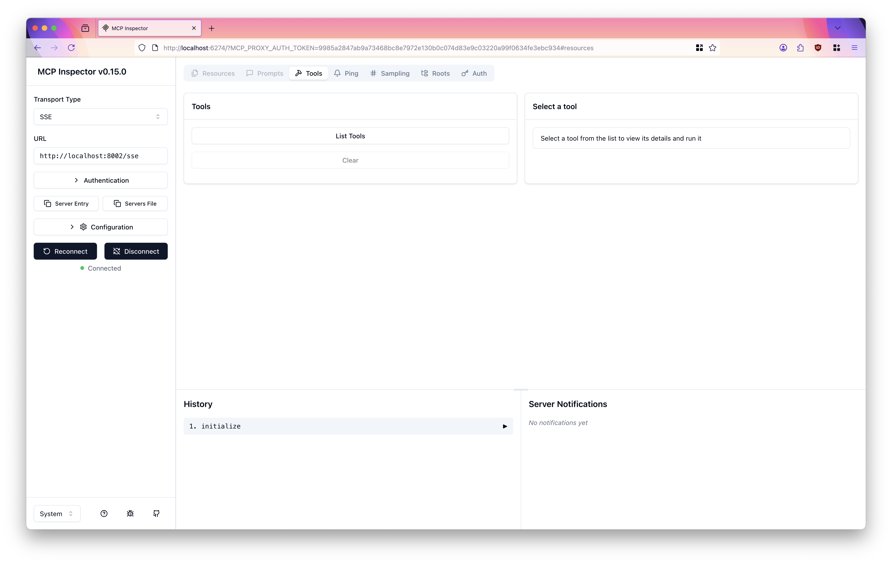
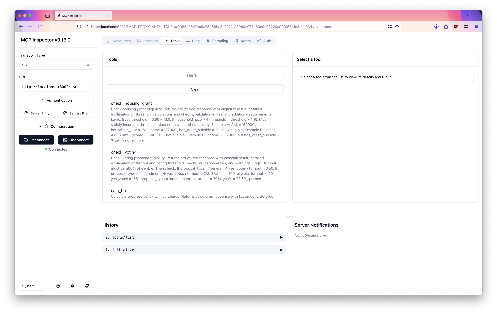
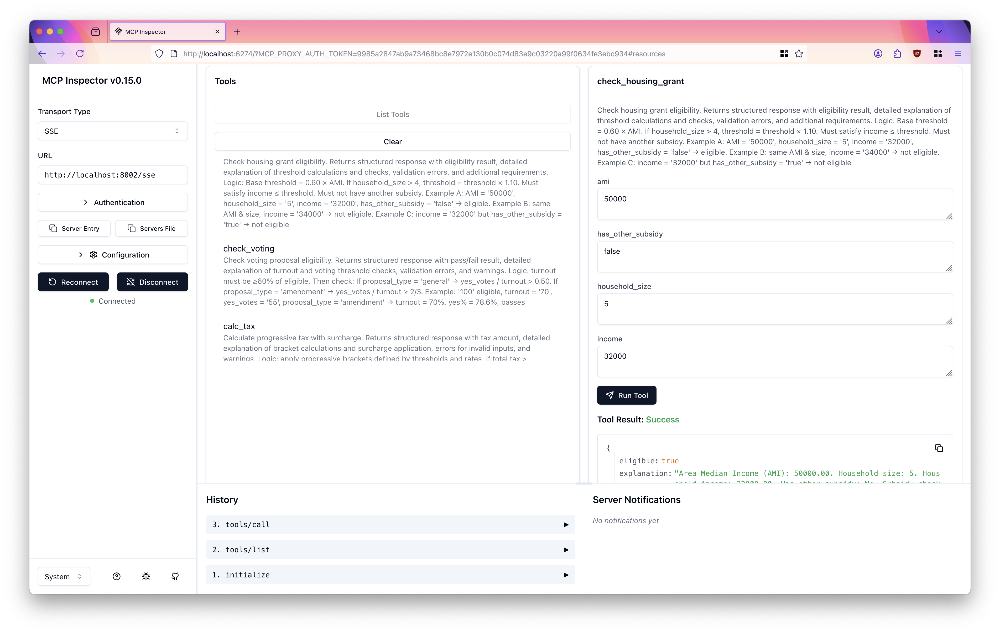
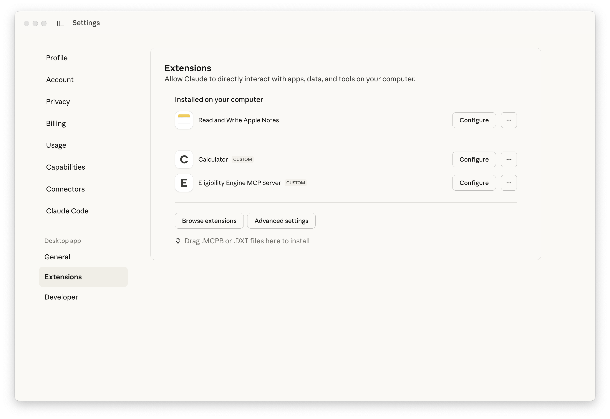
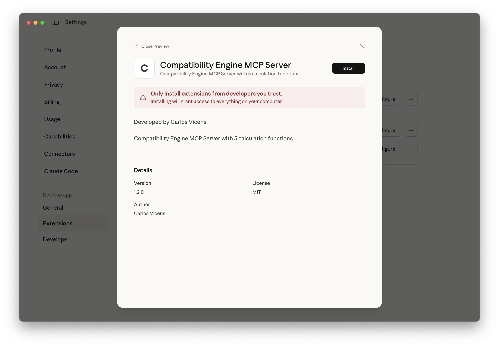
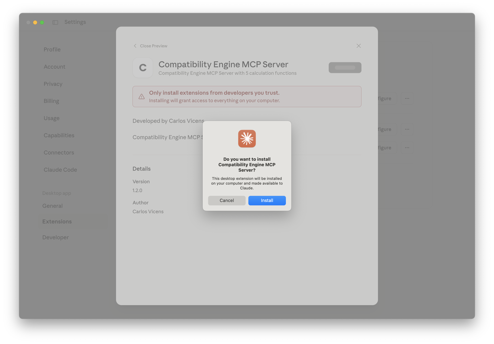
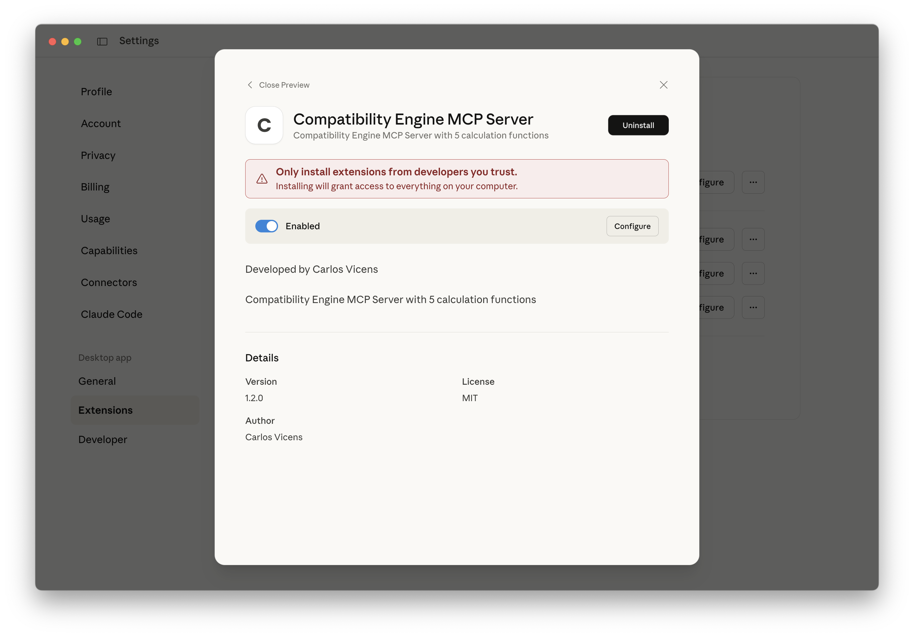
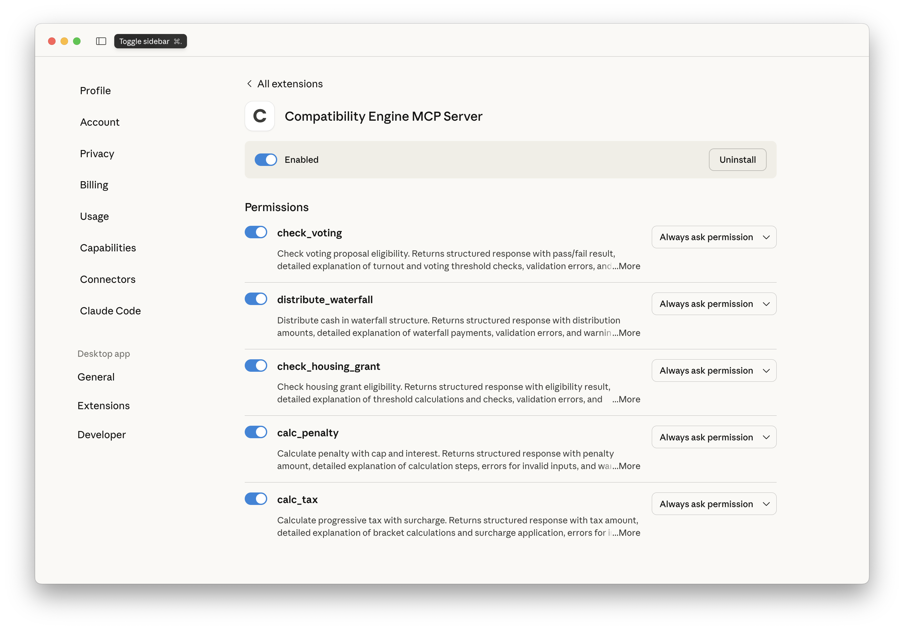
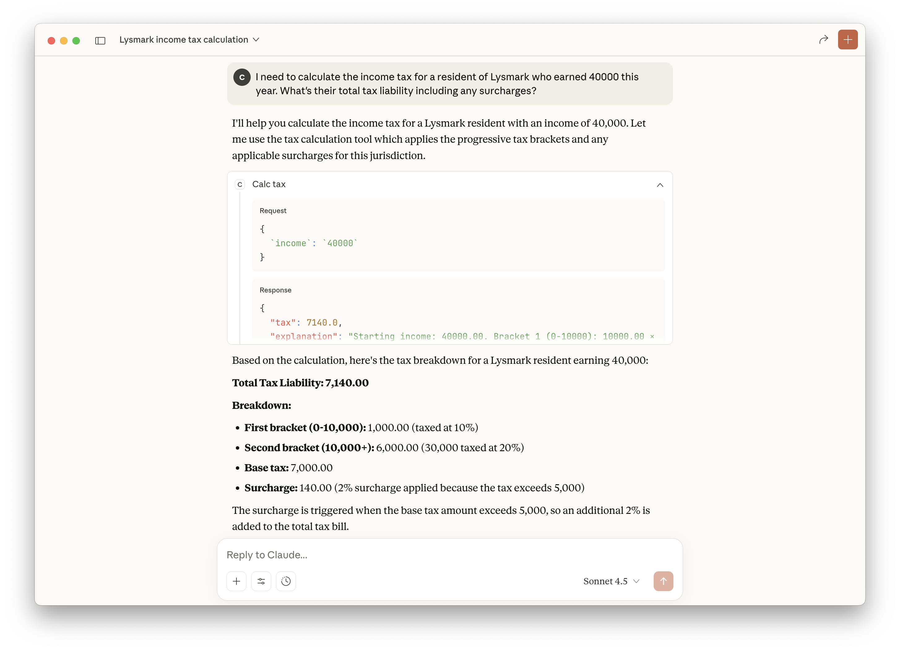

# Cluster Insights MCP Server

> **Kubernetes Cluster Resource Analysis and Management via Model Context Protocol (MCP)**

[](https://github.com/alpha-hack-program/cluster-insights-mcp-rs/actions/workflows/ci.yml)
[](https://opensource.org/licenses/MIT)
[](https://www.rust-lang.org/)

A production-ready Model Context Protocol (MCP) server developed in Rust that provides intelligent Kubernetes cluster analysis and resource management capabilities. This project demonstrates how LLMs can interact with live Kubernetes clusters through a standardized MCP interface.

## Why an MCP Server for Kubernetes?

**The Challenge:** Managing Kubernetes clusters requires understanding complex resource allocation, capacity planning, and troubleshooting resource constraints. Platform engineers, SREs, and developers constantly ask questions like:

- *"Do we have enough resources to deploy this new workload?"*
- *"Which pods are consuming the most resources?"*
- *"Why is my namespace out of capacity?"*
- *"What's the resource utilization across our cluster?"*

**The Solution:** This MCP server bridges the gap between conversational AI and Kubernetes cluster management, enabling natural language queries that translate into real-time cluster insights.

**Benefits:**
- **Natural Language Interface**: Ask questions in plain English instead of complex kubectl commands
- **Real-time Insights**: Query live cluster data directly through kubeconfig
- **AI-Powered Analysis**: Let LLMs interpret resource data and provide recommendations
- **Production Ready**: Built with Rust for performance, safety, and reliability
- **Secure**: Uses existing kubeconfig credentials - no additional authentication needed

## ⚠️ **DISCLAIMER**

**This is a demonstration/example project** that connects to live Kubernetes clusters. This software:

- **Requires proper kubeconfig setup** to access your cluster
- **Only performs READ operations** - does not modify cluster state
- **Should be tested in non-production environments first**
- **Serves as a technical example of MCP server implementation**
- **Is NOT officially supported by Kubernetes, Red Hat, or OpenShift**

For production deployments, ensure proper RBAC permissions and security reviews.

## Introduction

Platform teams managing Kubernetes (including OpenShift, EKS, GKE, AKS) face constant challenges with resource allocation and capacity planning. Traditional tools require specialized knowledge and multiple commands to answer simple questions.

This MCP server enables **conversational cluster management** by providing AI assistants with six powerful Kubernetes insight functions that query live cluster data via your existing kubeconfig

## 🎯 Features

- **6 Kubernetes Insight Functions**: Real-time cluster resource analysis and capacity planning
- **Live Cluster Integration**: Connects to any Kubernetes cluster via kubeconfig
- **Zero Cluster Modification**: Read-only operations ensure cluster safety
- **Resource Analysis**: CPU, memory, and pod metrics across nodes and namespaces
- **Capacity Planning**: Check if workloads will fit before deployment
- **Replica Planning**: Intelligent capacity checks for scaling applications
- **Containerization**: Production-ready Podman/Docker setup
- **Claude Desktop Integration**: MCPB packaging for seamless AI assistant integration
- **Professional Version Management**: Automated version sync with cargo-release
- **CI/CD Pipeline**: Comprehensive GitHub Actions workflow
- **Production Grade**: Built with Rust for performance and reliability

## 📚 Quick Reference

| Task | Command | Description |
|------|---------|-------------|
| **🧪 Test** | `make test` | Run all tests |
| **🧪 Test SSE** | `make test-sse` | Run MCP server with SSE transport |
| **🧪 Test MCP** | `make test-mcp` | Run MCP server with Streamable HTTP transport |
| **🚀 Release** | `make release-patch` | Create new patch release |
| **📦 Package** | `make pack` | Create Claude Desktop package |
| **🐳 Container** | `make image-build` | Build container image |
| **ℹ️ Help** | `make help` | Show all commands |

## 📋 Available Functions

| Function | Description | Use Case |
|----------|-------------|----------|
| **get_cluster_capacity** | Get total cluster capacity and utilization | *"What's my cluster capacity?"* |
| **check_resource_fit** | Check if workload fits in available resources | *"Can I deploy 4 cores, 16GB?"* |
| **get_node_breakdown** | Detailed resource breakdown per node | *"Show me node-by-node resources"* |
| **get_namespace_usage** | Resource usage per namespace | *"Which namespace uses most resources?"* |
| **get_pod_resource_stats** | Top 20 pods by resource consumption | *"Which pods consume most CPU?"* |
| **check_replica_capacity** | Check if cluster can accommodate additional replicas | *"Can I add 10 more replicas?"* |

> **Note**: All functions query live cluster data via your kubeconfig - no mocking, real insights!

### Example Queries

#### 📊 Cluster Capacity Overview

**Natural Language Query:** *"What's the total capacity of my Kubernetes cluster?"*

**Example Response:**
```json
{
  "total_cpu_cores": 24.0,
  "total_memory_gb": 96.0,
  "allocated_cpu_cores": 12.5,
  "allocated_memory_gb": 48.2,
  "available_cpu_cores": 11.5,
  "available_memory_gb": 47.8,
  "node_count": 3,
  "explanation": "Cluster has 3 nodes. Total capacity: 24.00 CPU cores, 96.00 GB memory. 
                  Allocated (requests): 12.50 CPU cores (52.1%), 48.20 GB memory (50.2%). 
                  Available: 11.50 CPU cores, 47.80 GB memory."
}
```

#### ✅ Resource Fit Check

**Natural Language Query:** *"Can I deploy a workload that needs 4 CPU cores and 16GB of memory?"*

**Example Response:**
```json
{
  "fits": true,
  "available_cpu_cores": 11.5,
  "available_memory_gb": 47.8,
  "cpu_utilization_percent": 68.8,
  "memory_utilization_percent": 66.9,
  "explanation": "Resources FIT in cluster. Requested: 4.00 CPU cores, 16.00 GB memory. 
                  Available: 11.50 CPU cores, 47.80 GB memory. 
                  After allocation, cluster would be at 68.8% CPU and 66.9% memory utilization."
}
```

#### 🖥️ Node Breakdown

**Natural Language Query:** *"Show me the resource breakdown for each node in my cluster"*

**Example Response:**
```json
{
  "nodes": [
    {
      "name": "node-1",
      "total_cpu_cores": 8.0,
      "total_memory_gb": 32.0,
      "allocated_cpu_cores": 4.2,
      "allocated_memory_gb": 16.5,
      "available_cpu_cores": 3.8,
      "available_memory_gb": 15.5,
      "pod_count": 24
    },
    {
      "name": "node-2", 
      "total_cpu_cores": 8.0,
      "total_memory_gb": 32.0,
      "allocated_cpu_cores": 4.8,
      "allocated_memory_gb": 17.2,
      "available_cpu_cores": 3.2,
      "available_memory_gb": 14.8,
      "pod_count": 28
    },
    {
      "name": "node-3",
      "total_cpu_cores": 8.0,
      "total_memory_gb": 32.0,
      "allocated_cpu_cores": 3.5,
      "allocated_memory_gb": 14.5,
      "available_cpu_cores": 4.5,
      "available_memory_gb": 17.5,
      "pod_count": 20
    }
  ],
  "total_nodes": 3,
  "explanation": "Cluster has 3 nodes. Each node shows total capacity, allocated resources (requests), 
                  available resources, and pod count."
}
```

#### 📦 Namespace Usage

**Natural Language Query:** *"Which namespaces are using the most resources?"*

**Example Response:**
```json
{
  "namespaces": [
    {
      "namespace": "production",
      "cpu_requests_cores": 6.5,
      "memory_requests_gb": 24.0,
      "cpu_limits_cores": 12.0,
      "memory_limits_gb": 48.0,
      "pod_count": 35
    },
    {
      "namespace": "staging",
      "cpu_requests_cores": 3.2,
      "memory_requests_gb": 12.8,
      "cpu_limits_cores": 6.0,
      "memory_limits_gb": 24.0,
      "pod_count": 18
    },
    {
      "namespace": "development",
      "cpu_requests_cores": 2.8,
      "memory_requests_gb": 11.4,
      "cpu_limits_cores": 5.0,
      "memory_limits_gb": 20.0,
      "pod_count": 22
    }
  ],
  "total_namespaces": 3,
  "explanation": "Cluster has 3 namespaces. Resource usage shows CPU/memory requests and limits for each namespace, 
                  sorted by CPU requests (descending)."
}
```

#### 🔝 Top Resource-Consuming Pods

**Natural Language Query:** *"Which pods are consuming the most resources?"*

**Example Response:**
```json
{
  "top_pods": [
    {
      "name": "postgres-db-0",
      "namespace": "production",
      "cpu_requests_millicores": 2000,
      "memory_requests_mb": 4096,
      "cpu_limits_millicores": 4000,
      "memory_limits_mb": 8192,
      "node": "node-1"
    },
    {
      "name": "redis-cluster-0",
      "namespace": "production",
      "cpu_requests_millicores": 1500,
      "memory_requests_mb": 3072,
      "cpu_limits_millicores": 3000,
      "memory_limits_mb": 6144,
      "node": "node-2"
    }
  ],
  "total_pods": 72,
  "sorted_by": "CPU requests (descending)",
  "explanation": "Showing top 20 pods (out of 72) by CPU requests. Each pod shows CPU/memory requests and limits, 
                  along with the node it's scheduled on."
}
```

#### 🔄 Check Replica Capacity (NEW!)

**Natural Language Query:** *"Do I have enough capacity for 10 more my-application replicas in namespace default?"*

**What it does:**
- Finds an existing pod matching your application name in the specified namespace
- Calculates the resource requirements per replica
- Checks if the cluster has enough capacity for the requested number of additional replicas
- Provides detailed analysis with projected utilization

**Example Response (Success):**
```json
{
  "fits": true,
  "reference_pod": "my-application-7f8b5c9d6-abc12",
  "cpu_per_replica_cores": 0.5,
  "memory_per_replica_gb": 1.0,
  "total_cpu_required_cores": 5.0,
  "total_memory_required_gb": 10.0,
  "available_cpu_cores": 11.5,
  "available_memory_gb": 47.8,
  "current_pod_count": 3,
  "projected_cpu_utilization_percent": 72.9,
  "projected_memory_utilization_percent": 60.6,
  "explanation": "✓ Capacity CHECK PASSED: You can add 10 more replicas of 'my-application' in namespace 'default'.
  
  Reference pod: my-application-7f8b5c9d6-abc12
  - CPU per replica: 0.500 cores
  - Memory per replica: 1.000 GB
  
  Total required for 10 replicas:
  - CPU: 5.000 cores
  - Memory: 10.000 GB
  
  Cluster availability:
  - Available CPU: 11.500 cores (enough for 23 replicas)
  - Available Memory: 47.800 GB (enough for 47 replicas)
  
  Projected utilization after adding replicas:
  - CPU: 72.9% (current: 52.1%)
  - Memory: 60.6% (current: 50.2%)
  
  Current pods matching 'my-application': 3"
}
```

**Example Response (Insufficient Capacity):**
```json
{
  "fits": false,
  "reference_pod": "my-application-7f8b5c9d6-abc12",
  "cpu_per_replica_cores": 2.0,
  "memory_per_replica_gb": 4.0,
  "total_cpu_required_cores": 20.0,
  "total_memory_required_gb": 40.0,
  "available_cpu_cores": 11.5,
  "available_memory_gb": 47.8,
  "current_pod_count": 3,
  "projected_cpu_utilization_percent": 135.4,
  "projected_memory_utilization_percent": 92.1,
  "explanation": "✗ Capacity CHECK FAILED: Cannot add 10 replicas of 'my-application' in namespace 'default'.
  
  Reference pod: my-application-7f8b5c9d6-abc12
  - CPU per replica: 2.000 cores
  - Memory per replica: 4.000 GB
  
  Total required for 10 replicas:
  - CPU: 20.000 cores
  - Memory: 40.000 GB
  
  Issues:
  CPU shortage: Need 20.000 cores but only 11.500 available (shortfall: 8.500 cores). Maximum possible replicas based on CPU: 5
  
  Current pods matching 'my-application': 3"
}
```

**Key Benefits:**
- ✅ **One-step capacity check** - No need to manually calculate replica resources
- ✅ **Automatic resource discovery** - Finds existing pods and extracts requirements
- ✅ **Clear recommendations** - Shows exactly how many replicas are possible
- ✅ **Projected utilization** - See cluster state after scaling
- ✅ **Actionable insights** - Immediate yes/no answer with detailed reasoning

### 💡 Usage Tips for LLM Integration

When querying the LLM with this MCP agent:

1. **Ask in natural language** - No need to know Kubernetes API details
   - *"Do I have enough capacity for 10 more my-application replicas in namespace default?"*
   - *"Which namespace is hogging all the memory?"*
   - *"Show me resource utilization across all nodes"*

2. **Capacity Planning Scenarios**
   - *"I need to deploy 5 pods with 500m CPU and 1GB RAM each - will they fit?"*
   - *"What's my current cluster utilization percentage?"*
   - *"How much CPU is available for new workloads?"*

3. **Troubleshooting**
   - *"Why can't I schedule more pods in the development namespace?"*
   - *"Which pods should I consider scaling down to free up resources?"*
   - *"Are any nodes heavily over-allocated?"*

4. **Resource Optimization**
   - *"Compare resource usage between production and staging namespaces"*
   - *"Find the top 5 most resource-intensive applications"*
   - *"What's the resource distribution across my nodes?"*

5. **Combine with AI Recommendations**
   - The LLM can analyze the raw data and provide intelligent insights
   - Ask for recommendations based on current utilization patterns
   - Get suggestions for resource optimization and rebalancing

## 🚀 Quick Start

### Prerequisites

- Rust 1.70+ ([Install Rust](https://rustup.rs/))
- Cargo (included with Rust)
- **Kubernetes cluster access** with valid `~/.kube/config`
- `jq` for JSON processing ([Install jq](https://jqlang.github.io/jq/download/))
- `cargo-release` for version management: `cargo install cargo-release`
- NodeJS 19+ for testing with [MCP Inspector](https://modelcontextprotocol.io/docs/tools/inspector) (optional)

### 🔐 Cluster Access Setup

This MCP server reads cluster data via your kubeconfig. Ensure you have access:

```bash
# Verify cluster access
kubectl cluster-info
kubectl get nodes

# The MCP server will use the current context in ~/.kube/config
kubectl config current-context
```

**Supported Kubernetes Platforms:**
- Vanilla Kubernetes
- Red Hat OpenShift
- Amazon EKS
- Google GKE
- Azure AKS
- Any kubeconfig-compatible cluster

### 📥 Installation

```bash
# Clone the repository
git clone https://github.com/alpha-hack-program/cluster-insights-mcp-rs.git
cd cluster-insights-mcp-rs
```

### 🏗️ Build

```bash
# Build all servers
make build-all

# Or build individually
make build-sse      # SSE Server
make build-mcp      # MCP HTTP Server
make build-stdio    # STDIO Server for Claude
```

### 🧪 Unit Testing

```bash
# Run all tests
make test
```

### 🏃‍♂️ Running

> **NOTE:**
>
> By default `BIND_ADDRESS=127.0.0.1:8000` for **SSE** and `BIND_ADDRESS=127.0.0.1:8001` for **Streamable HTTP**
>
> BUT in the *Makefile* both `test-sse` and `test-mcp` targets set `BIND_ADDRESS=0.0.0.0:8001`

```bash
# SSE Server (recommended for Llama Stack, being deprecated in MCP Standard)
make test-sse

# MCP Streamable HTTP Server
make test-mcp

# Or directly
RUST_LOG=info BIND_ADDRESS=127.0.0.1:8003 ./target/release/sse_server
```

### 🧪 Testing With MCP Inspector

Let's run the MCP server with SSE transport in one terminal:

```bash
make test-sse
```

**Output:**
```
2024-10-18T10:15:32.123Z INFO  Cluster Insights MCP Server starting...
2024-10-18T10:15:32.125Z INFO  SSE server listening on http://0.0.0.0:8003
```

Run MCP inspector with `make inspector`:

> **NOTE:** NodeJS 19+ has to be installed

```bash
$ make inspector
npx @modelcontextprotocol/inspector
Starting MCP inspector...
⚙️ Proxy server listening on 127.0.0.1:6277
🔑 Session token: 6f0fdc22e2a9775a95d60c976b37b873bffec1816002fc702ca8ec7186a7c338
Use this token to authenticate requests or set DANGEROUSLY_OMIT_AUTH=true to disable auth

🔗 Open inspector with token pre-filled:
   http://localhost:6274/?MCP_PROXY_AUTH_TOKEN=6f0fdc22e2a9775a95d60c976b37b873bffec1816002fc702ca8ec7186a7c338

🔍 MCP Inspector is up and running at http://127.0.0.1:6274 🚀
```

Open a browser and point to the URL with the token pre-filled.



Make sure:
- **Transport Type:** `SSE`
- **URL:** `http://localhost:8003/sse`

Then click `connect`.



Now click on `List Tools`, then you should see the list of tools:



Finally click on `get_cluster_capacity` and click `Run tool`:



You should see real cluster capacity data from your Kubernetes cluster!

**Expected Output:**
```json
{
  "total_cpu_cores": 24.0,
  "total_memory_gb": 96.0,
  "allocated_cpu_cores": 12.5,
  "allocated_memory_gb": 48.2,
  "available_cpu_cores": 11.5,
  "available_memory_gb": 47.8,
  "node_count": 3,
  "explanation": "Cluster has 3 nodes. Total capacity: 24.00 CPU cores..."
}
```

Congratulations! Your Cluster Insights tool is ready to be used by an MCP-enabled agent.


## 📦 Claude Desktop Integration

### Packaging

```bash
# Create MCP Bundle (MCPB) package for Claude Desktop
$ make pack
cargo build --release --bin stdio_server
   Compiling cluster-insights-mcp-server v1.0.8 (/Users/.../cluster-insights-mcp-rs)
    Finished `release` profile [optimized] target(s) in 18.23s
Packing MCP server for Claude Desktop...
chmod +x ./target/release/stdio_server
zip -rX cluster-insights-mcp-server.mcpb -j mcpb/manifest.json ./target/release/stdio_server
updating: manifest.json (deflated 49%)
updating: stdio_server (deflated 63%)
```

### Example Claude Configuration

Open Claude Desktop and go to `Settings->Extensions` dropping area.


> **Note**: This demonstrates MCP integration patterns and is not intended for production use with real data.

Drag and drop the `MCPB` file.



Click on `Install`:



Click on `Install`:



Click on `Configure` then close the dialog.



Your're ready to go, open a new chat:



Use this example query: *"What's the current capacity of my Kubernetes cluster? Show me the total resources and how much is currently allocated."*



Congratulations! The Cluster Insights tool now works with Claude Desktop and can analyze your live Kubernetes cluster.

## 🔧 Configuration

### Environment Variables

```bash
# Logging level (debug, info, warn, error)
RUST_LOG=info           

# Or use BIND_ADDRESS directly
BIND_ADDRESS=127.0.0.1:8000
```

### Example Usage

The MCP server automatically connects to your Kubernetes cluster using `~/.kube/config`.

#### Query Cluster Capacity

**Via MCP Inspector or Claude:**
Simply ask: *"What's my cluster capacity?"*

The tool will return real-time data from your cluster showing total CPU/memory, allocated resources, and availability.

#### Check Resource Fit

**Via MCP Inspector:**
Use the `check_resource_fit` tool with parameters:
```json
{
  "cpu_cores": 4.0,
  "memory_gb": 16.0
}
```

**Via Claude/LLM:**
Ask: *"Can I deploy a workload that needs 4 CPU cores and 16GB of memory?"*

> **Important**: All queries return live data from your actual Kubernetes cluster.

## 🐳 Containerization

### Build and Run

This requires `podman` or `docker`. Configuration is managed through `.env` file.

```bash
# Build container image
scripts/image.sh build

# Run locally
scripts/image.sh run

# Run from remote registry
scripts/image.sh push
scripts/image.sh run-remote

# Show container information
scripts/image.sh info
```

### Environment Variables for Containers

```bash
# Production configuration with kubeconfig
podman run -p 8001:8001 \
  -v ~/.kube/config:/app/.kube/config:ro \
  -e KUBECONFIG=/app/.kube/config \
  -e BIND_ADDRESS=0.0.0.0:8001 \
  -e RUST_LOG=info \
  quay.io/atarazana/cluster-insights-mcp-server:latest
```

> **Security Note**: The container needs read access to your kubeconfig to query the cluster. Never expose this container publicly without proper authentication.


## 🛠️ Development

### Available Commands

#### 🏗️ Build Commands
```bash
make build-all              # Build all servers
make build-mcp              # Build MCP server (streamable-http)
make build-sse              # Build SSE server
make build-stdio            # Build stdio server
make pack                   # Pack MCP server for Claude Desktop
```

#### 🚀 Release Commands (cargo-release)
```bash
make release-patch          # Create patch release (1.0.6 → 1.0.7)
make release-minor          # Create minor release (1.0.6 → 1.1.0)
make release-major          # Create major release (1.0.6 → 2.0.0)
make release-dry-run        # Show what release-patch would do
make sync-version           # Manually sync version to all files
```

#### 🧪 Test Commands
```bash
make test                   # Run all tests
make test-sse               # Test SSE server locally
make test-mcp               # Test MCP server locally
```

#### 🔧 Development Commands
```bash
make clean                  # Clean build artifacts
make help                   # Show all available commands
```

### Project Structure

```
├── src/                                    # Source code
│   ├── common/
│   │   ├── cluster_insights.rs            # Kubernetes cluster analysis logic
│   │   ├── metrics.rs                     # Prometheus metrics
│   │   └── mod.rs
│   ├── sse_server.rs                      # SSE Server
│   ├── mcp_server.rs                      # MCP HTTP Server
│   └── stdio_server.rs                    # STDIO Server
├── scripts/                               # Utility scripts
│   ├── sync-manifest-version.sh           # Version sync for cargo-release
│   └── image.sh                          # Container management script
├── mcpb/
│   └── manifest.json                      # Claude Desktop manifest
├── .github/workflows/                     # CI/CD pipelines
│   └── ci.yml                            # GitHub Actions workflow
├── docs/                                  # Documentation
├── .env                                   # Environment variables
├── Containerfile                          # Container definition
├── Cargo.toml                            # Rust package manifest
└── Makefile                              # Build commands
```

### Function Parameters

#### get_cluster_capacity
**No parameters required**

Returns:
- `total_cpu_cores`: Total cluster CPU capacity
- `total_memory_gb`: Total cluster memory capacity
- `allocated_cpu_cores`: CPU already requested by pods
- `allocated_memory_gb`: Memory already requested by pods
- `available_cpu_cores`: Available CPU capacity
- `available_memory_gb`: Available memory capacity
- `node_count`: Number of nodes
- `explanation`: Human-readable summary

#### check_resource_fit
| Field | Type | Description |
|-------|------|-------------|
| `cpu_cores` | number | Required CPU in cores (e.g., 4.0) |
| `memory_gb` | number | Required memory in GB (e.g., 16.0) |

Returns:
- `fits`: Boolean indicating if resources fit
- `available_cpu_cores`: Available CPU
- `available_memory_gb`: Available memory
- `cpu_utilization_percent`: Projected CPU utilization
- `memory_utilization_percent`: Projected memory utilization
- `explanation`: Human-readable summary

#### get_node_breakdown
**No parameters required**

Returns:
- `nodes`: Array of node information
  - `name`: Node name
  - `total_cpu_cores`: Node CPU capacity
  - `total_memory_gb`: Node memory capacity
  - `allocated_cpu_cores`: Allocated CPU
  - `allocated_memory_gb`: Allocated memory
  - `available_cpu_cores`: Available CPU
  - `available_memory_gb`: Available memory
  - `pod_count`: Number of pods on node
- `total_nodes`: Total node count
- `explanation`: Human-readable summary

#### get_namespace_usage
**No parameters required**

Returns:
- `namespaces`: Array of namespace information
  - `namespace`: Namespace name
  - `cpu_requests_cores`: Total CPU requests
  - `memory_requests_gb`: Total memory requests
  - `cpu_limits_cores`: Total CPU limits
  - `memory_limits_gb`: Total memory limits
  - `pod_count`: Number of pods
- `total_namespaces`: Total namespace count
- `explanation`: Human-readable summary

#### get_pod_resource_stats
**No parameters required**

Returns:
- `top_pods`: Array of top 20 pods by CPU requests
  - `name`: Pod name
  - `namespace`: Pod namespace
  - `cpu_requests_millicores`: CPU requests in millicores
  - `memory_requests_mb`: Memory requests in MB
  - `cpu_limits_millicores`: CPU limits in millicores
  - `memory_limits_mb`: Memory limits in MB
  - `node`: Node where pod is scheduled
- `total_pods`: Total pod count
- `sorted_by`: Sort criteria used
- `explanation`: Human-readable summary

## 🔒 Security

- **Read-Only Operations**: Only performs read operations on the cluster - never modifies resources
- **Kubeconfig Authentication**: Uses existing kubeconfig credentials with proper RBAC
- **Input Validation**: Strict JSON schemas with type checking
- **Non-root User**: Containers run as user `1001`
- **Security Audit**: `cargo audit` in CI/CD pipeline
- **Minimal Image**: Based on UBI 9 minimal for reduced attack surface

### Required Kubernetes RBAC Permissions

The service account or user running this server needs the following permissions:

```yaml
apiVersion: rbac.authorization.k8s.io/v1
kind: ClusterRole
metadata:
  name: cluster-insights-reader
rules:
- apiGroups: [""]
  resources: ["nodes", "pods", "namespaces"]
  verbs: ["get", "list"]
```

> **Note**: Only read permissions are required. The server never modifies cluster resources.

## 🤝 Contributing

### Development Workflow

1. **Fork the project**
2. **Create feature branch**: `git checkout -b feature/new-feature`
3. **Make changes and test**: `make test`
4. **Commit changes**: `git commit -am 'Add new feature'`
5. **Push to branch**: `git push origin feature/new-feature`
6. **Create Pull Request**

### Professional Release Process

1. **Development**: Make changes, test with `make test`
2. **Version Bump**: Use `make release-patch/minor/major`
3. **Build**: Use `make pack` for Claude Desktop integration
4. **Container**: Use `make image-build` for containerization

### Guidelines

- **Code Quality**: Follow `cargo fmt` and pass `cargo clippy`
- **Testing**: Add tests for new functionality
- **Version Management**: Let cargo-release handle versioning
- **CI/CD**: Ensure all GitHub Actions pass
- **Documentation**: Update README.md as needed
- **Professional Structure**: Keep scripts in `scripts/` directory

## ⚙️ Version Management

This project uses **cargo-release** for professional version management with automatic synchronization across all configuration files.

From `Cargo.toml` release configuration:

```toml
[package.metadata.release]
# Don't publish to crates.io (since this is a binary project)
publish = false
# Don't push git tags (you can enable this if you want)
push = false
# Run pre-release hook
pre-release-hook = ["scripts/sync-manifest-version.sh"]
# Create git tag with 'v' prefix
tag-name = "v{{version}}"
# Sign tags (optional)
sign-tag = false
```

### 🔄 Version Sync System

- **Single Source of Truth**: `Cargo.toml` version controls everything
- **Automatic Sync**: Updates `mcpb/manifest.json` and `.env` automatically
- **Git Integration**: Creates commits and tags automatically

### 📦 Release Workflow

Work on your code, then when happy with it:

```bash
# 1. Make your changes and commit them
git add -A && git commit -m "feat: your changes"

# 2. Create a release (choose appropriate version bump)
make release-patch     # Bug fixes: 1.0.6 → 1.0.7
make release-minor     # New features: 1.0.6 → 1.1.0  
make release-major     # Breaking changes: 1.0.6 → 2.0.0

# 3. Build and package
make pack
make image-build
make image-push

# 4. Push to repository
git push && git push --tags
```

### 🔍 Preview Changes

```bash
# See what would happen without making changes
make release-dry-run
```

### 🛠️ Manual Version Sync (Development)

```bash
# Sync version from Cargo.toml to other files manually
make sync-version
```

## 💬 Sample LLM Queries

When using this MCP agent with an LLM, users can ask natural language questions about their Kubernetes cluster. Here are realistic scenarios:

### 📊 Capacity Planning

#### Query 1: Basic Capacity Check
**Query:** *"What's my cluster's current capacity and utilization?"*

The LLM will call `get_cluster_capacity` and explain the results in natural language, helping you understand how much of your cluster is in use.

#### Query 2: Pre-Deployment Check
**Query:** *"I'm planning to deploy an application that needs 8 CPU cores and 32GB of memory. Do I have enough resources?"*

The LLM will call `check_resource_fit` with the specified parameters and tell you whether the deployment will succeed.

### 🔍 Troubleshooting

#### Query 3: Resource Investigation
**Query:** *"I'm getting pod scheduling failures in the production namespace. Can you help me understand why?"*

The LLM will call multiple functions (`get_cluster_capacity`, `get_namespace_usage`, `get_node_breakdown`) to analyze the situation and provide insights.

#### Query 4: Resource Hog Identification
**Query:** *"Which applications are using the most resources in my cluster?"*

The LLM will use `get_pod_resource_stats` and `get_namespace_usage` to identify resource-intensive workloads.

### 🎯 Optimization

#### Query 5: Node Balance Check
**Query:** *"Are my workloads evenly distributed across nodes?"*

The LLM will use `get_node_breakdown` to analyze resource distribution and suggest rebalancing if needed.

#### Query 6: Namespace Comparison
**Query:** *"Compare resource usage between my production and staging environments"*

The LLM will use `get_namespace_usage` to compare resource consumption and provide recommendations.

### 🚀 Advanced Scenarios

#### Query 7: Multi-Step Analysis
**Query:** *"I need to deploy 5 replicas of a service that requires 2 CPUs and 4GB RAM each. Can you tell me if it will fit, and if so, what my utilization will be after deployment?"*

The LLM will:
1. Calculate total requirements (10 CPUs, 20GB RAM)
2. Call `check_resource_fit` with those values
3. Explain the projected utilization percentages

#### Query 8: Comprehensive Cluster Report
**Query:** *"Give me a complete overview of my cluster's resource state"*

The LLM will call all available functions to provide a comprehensive report including capacity, node breakdown, namespace usage, and top resource consumers.

**Key Advantages:**
- **Natural Language**: No need to know Kubernetes API details
- **Context-Aware**: LLM interprets results in context of your question
- **Multi-Function**: LLM can chain multiple tool calls for complex queries
- **Recommendations**: LLM can provide actionable advice based on the data

## 📄 License

This project is licensed under the MIT License - see [LICENSE](LICENSE) for details.

### CI/CD Pipeline

The project includes a comprehensive GitHub Actions workflow:
- ✅ **Automated Testing**: Unit tests and integration tests
- ✅ **Version Sync Validation**: Tests cargo-release functionality  
- ✅ **Container Building**: Tests containerization process
- ✅ **Artifact Management**: Builds and uploads release artifacts
- ✅ **Cross-platform Support**: Tests on Ubuntu with multiple container runtimes

## 🙋 Support

- **Issues**: [GitHub Issues](https://github.com/alpha-hack-program/cluster-insights-mcp-rs/issues)
- **Documentation**: [Project Wiki](https://github.com/alpha-hack-program/cluster-insights-mcp-rs/wiki)
- **CI/CD**: Automated testing and deployment via GitHub Actions

## 🏷️ Tags

`mcp` `model-context-protocol` `rust` `kubernetes` `cluster-management` `capacity-planning` `resource-analysis` `openshift` `devops` `sre` `platform-engineering` `claude` `cargo-release` `containerization` `ci-cd` `observability`

---

**Developed with ❤️ by [Alpha Hack Group](https://github.com/alpha-hack-program)**